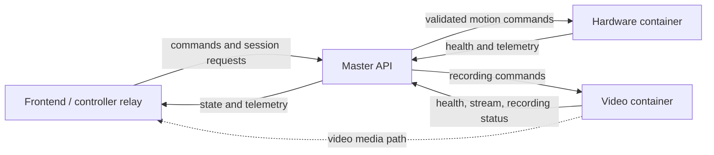
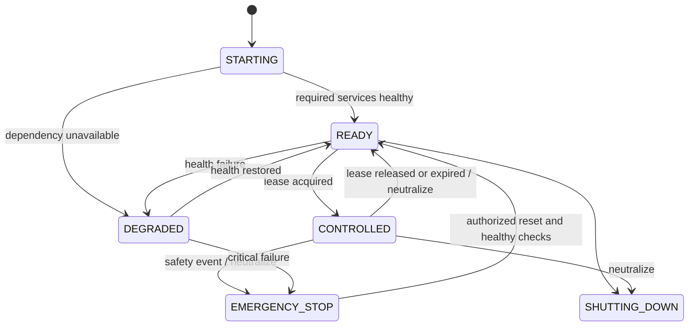

# Master API Research Notes

## Purpose

These notes turn the Master API requirements in [CC_Proposal.pdf](./CC_Proposal.pdf) into the topics and decisions that should be understood before implementation. This week can remain research-focused; the output should be a clear API contract, state model, and testing plan rather than a large amount of code.

The proposal says the Master API must:

- act as the central orchestrator between the frontend, hardware container, and video container;
- expose steering, throttle/car-control, recording, and telemetry endpoints;
- enforce system rules with a state machine;
- allow one driver while still allowing multiple spectators;
- issue or validate session tokens;
- collect logs, errors, and telemetry; and
- monitor the whole system.

## 1. System boundary

The Master API should make decisions and coordinate components, but it should not directly manipulate GPIO pins or capture/encode video.



Important boundary decisions:

- Video should normally stream directly from the video service to the client. Sending the media through the Master API would add latency and load. The Master API should control recording and publish stream metadata/status.
- The Master API validates permissions and system state before forwarding a command.
- The hardware container must still enforce steering limits, throttle limits, command-rate limits, and its own watchdog. Safety cannot depend only on a cellular connection or one API process.
- Internal services need explicit request/response contracts even if they are all written in Python.

## 2. Communication choices

Use each protocol for the kind of traffic it handles best:

| Traffic | Suggested MVP transport | Reason |
| --- | --- | --- |
| Acquire/release control | HTTP REST | Infrequent request/response operations |
| Start/stop recording | HTTP REST | Discrete, auditable operations |
| Current state/health | HTTP `GET` | Easy to inspect, document, and test |
| Steering/throttle | Begin with HTTP for the mock; evaluate WebSocket | Inputs are frequent and latency-sensitive |
| Live telemetry/status | WebSocket, with HTTP snapshot fallback | Server can push repeated updates without polling |
| Video media | Direct video-streaming protocol, not JSON through Master API | Video has different bandwidth and latency needs |

FastAPI supports authenticated WebSocket endpoints and long-lived two-way connections ([FastAPI WebSockets](https://fastapi.tiangolo.com/advanced/websockets/)). The team should measure the actual command rate and latency before deciding whether HTTP is sufficient for driving. A simple HTTP mock is still the fastest way to validate the contract first.

Questions to answer experimentally:

- How many controller updates per second are required for steering to feel smooth: 10, 20, 30, or more?
- What are typical and worst-case cellular round-trip times and packet-loss behavior?
- Should the controller send every sample, or only changes plus a periodic heartbeat?
- Can stale commands be identified by a monotonically increasing `sequence` number and client timestamp?
- What should happen when command delivery is delayed, duplicated, or reordered?

## 3. API contract to design before coding

Use a version prefix such as `/api/v1`. Define typed Pydantic request and response models rather than passing unstructured dictionaries. FastAPI uses these models for validation and OpenAPI documentation ([request models](https://fastapi.tiangolo.com/tutorial/body-nested-models/)), while response models validate and filter outgoing data ([response models](https://fastapi.tiangolo.com/tutorial/response-model/)).

### Candidate MVP endpoints

| Method and path | Purpose | Access |
| --- | --- | --- |
| `GET /api/v1/health/live` | Is the Master API process alive? | Public/internal |
| `GET /api/v1/health/ready` | Can it reach required services and safely accept work? | Public/internal |
| `GET /api/v1/system/state` | System state and component summaries | Spectator or driver |
| `GET /api/v1/telemetry` | Latest telemetry snapshot | Spectator or driver |
| `WS /api/v1/telemetry/ws` | Live telemetry and status updates | Spectator or driver |
| `POST /api/v1/control/lease` | Request exclusive driver control | Authenticated user |
| `POST /api/v1/control/lease/heartbeat` | Renew the active control lease | Active driver only |
| `DELETE /api/v1/control/lease` | Release driver control and neutralize car | Active driver only |
| `PUT /api/v1/control/motion` | Set normalized steering and throttle | Active driver only |
| `POST /api/v1/control/emergency-stop` | Immediately request safe stop | Define policy explicitly |
| `POST /api/v1/video/recordings` | Start a recording | Active driver initially |
| `DELETE /api/v1/video/recordings/current` | Stop the active recording | Active driver initially |
| `GET /api/v1/video/status` | Stream and recording status | Spectator or driver |

The exact paths can change. Consistency matters more than these names.

### Suggested motion-command shape

```json
{
  "steering": -0.35,
  "throttle": 0.60,
  "sequence": 1842,
  "client_sent_at": "2026-09-25T18:25:43.511Z"
}
```

Design notes:

- Normalize `steering` and `throttle` to `[-1.0, 1.0]`; map these values to device-specific PWM only in the hardware container.
- Decide whether negative throttle means reverse and whether changing directly between forward and reverse is allowed.
- Reject non-finite numbers, out-of-range values, unknown fields, old sequence numbers, and commands sent without the active lease.
- Include the applied values and server timestamp in the response or subsequent telemetry. Requested and applied values may differ because of limits or smoothing.
- Give every error a stable machine-readable code, a readable message, and a request/correlation ID.

### Status-code behavior to decide

- `200` or `204`: command accepted/applied according to the documented contract.
- `401`: no valid identity token.
- `403`: authenticated but not permitted.
- `409`: conflicts with current state, such as another user holding the lease or recording already being active.
- `422`: invalid command body or range.
- `429`: command-rate limit exceeded.
- `503`: required hardware/video service unavailable or system not ready.
- `504`: downstream service did not respond before its deadline.

## 4. Authentication is not the control lease

Keep these ideas separate:

- **Authentication token:** proves who the user is and may last for a normal login session.
- **Role/permission:** says whether that user may spectate, drive, or administer.
- **Control lease:** short-lived exclusive ownership of the car. There can be at most one active lease.

A JWT is signed but not encrypted, so private data should not be put in its payload. FastAPI documents bearer-token and expiring-JWT patterns ([FastAPI OAuth2/JWT guide](https://fastapi.tiangolo.com/tutorial/security/oauth2-jwt/)). For an early trusted-network prototype, an opaque random login token may be simpler than building a complete user system, but it still needs expiration and secure storage.

The control lease should contain or track:

- `lease_id` (unguessable identifier);
- `user_id`;
- `acquired_at` and `expires_at`;
- last heartbeat time;
- connection/client identifier; and
- status such as `active`, `released`, `expired`, or `revoked`.

Lease rules to research and specify:

1. Lease acquisition must be atomic so two simultaneous requests cannot both win.
2. Only the active lease can send motion or normal driving commands.
3. A heartbeat renews the lease for a short duration.
4. Disconnect, missed heartbeat, explicit release, logout, API shutdown, or emergency state must command neutral throttle and invalidate the lease.
5. Spectators can read telemetry but cannot call motion endpoints.
6. Decide whether an administrator can revoke a stuck lease.

An in-memory lease is acceptable for a one-process mock, but it is lost on restart and does not work correctly with multiple API workers. If the Master API later runs multiple workers or replicas, lease ownership and state need one shared transactional store, such as Redis or a database.

FastAPI dependencies are a useful place to centralize token validation, active-lease checks, and role checks instead of duplicating them in endpoints ([FastAPI dependencies](https://fastapi.tiangolo.com/tutorial/dependencies/)).

## 5. State machine

Do not represent system behavior as several unrelated booleans. Define explicit states, legal transitions, guards, and side effects.

### Candidate top-level states

| State | Meaning | Motion allowed? |
| --- | --- | --- |
| `STARTING` | API is initializing and checking dependencies | No |
| `READY` | Components are healthy; no driver owns control | No |
| `CONTROLLED` | A valid driver lease exists | Yes |
| `DEGRADED` | A noncritical component failed, such as recording | Decide explicitly; default no until analyzed |
| `EMERGENCY_STOP` | Latched safety stop | No |
| `SHUTTING_DOWN` | API is closing and neutralizing outputs | No |

Example transitions:



For every transition, document:

- triggering event;
- guard conditions;
- state update;
- commands sent to downstream services;
- event logged;
- response sent to clients; and
- behavior when a downstream command times out or partially succeeds.

Recording should probably be a separate sub-state (`idle`, `starting`, `recording`, `stopping`, `failed`) rather than multiplying top-level car states.

## 6. Failure handling and safety

This is a remote vehicle, so failure behavior is part of the API contract rather than an optional later feature.

### Fail-safe defaults

- On startup, assume the car is not controllable until required health checks pass.
- On lease timeout, driver disconnect, stale-command timeout, internal exception, or shutdown, request steering/throttle neutralization.
- The hardware service should independently set throttle to zero if it has not received a valid command within its watchdog interval.
- Give downstream calls short, explicit deadlines. HTTPX distinguishes connect, read, write, and connection-pool timeouts ([HTTPX timeouts](https://www.python-httpx.org/advanced/timeouts/)).
- Do not blindly retry motion commands. A late retry can apply an obsolete input. Sequence numbers and idempotency rules must be designed first.
- It may be safe to retry read-only health checks; recording start/stop requires an idempotent design or operation ID before retrying.
- Reuse one application-scoped asynchronous HTTP client so calls do not repeatedly create connections. HTTPX recommends an `AsyncClient` for async frameworks and warns against creating clients in a hot loop ([HTTPX async support](https://www.python-httpx.org/async/)). FastAPI lifespan is the intended place for shared startup/shutdown resources ([FastAPI lifespan](https://fastapi.tiangolo.com/advanced/events/)).

### Emergency-stop questions

- Is emergency stop latched until an explicit authorized reset?
- Can any authenticated observer trigger it, or only the driver/admin?
- What if the hardware service cannot acknowledge it?
- Does resetting require throttle to be neutral and all critical health checks to pass?
- Is there also a physical emergency-stop mechanism?

## 7. Telemetry, health, and logs

These have different purposes:

- **Telemetry:** current car facts such as requested/applied steering, throttle, speed mode, location, battery, recording state, signal strength, and timestamps.
- **Health:** whether each service is alive and ready to perform its responsibility.
- **Logs/events:** a history used to explain what happened.
- **Metrics:** aggregated numerical behavior such as request counts, errors, timeouts, and latency.

Every telemetry item should include its source timestamp or age. Displaying an old value as current is dangerous. Define units in names or schemas (`speed_mps`, `battery_voltage`, `latency_ms`) and decide how the UI signals stale or unavailable readings.

Useful event fields:

```text
timestamp, level, event_type, request_id, user_id, lease_id,
system_state, component, result, latency_ms, error_code
```

Do not log passwords, bearer tokens, full lease tokens, or unnecessary personal data.

Candidate metrics include request totals, validation failures, rejected unauthorized commands, downstream timeouts, command latency, lease expirations, active WebSocket clients, and component health. Prometheus distinguishes counters, gauges, histograms, and summaries; histograms are appropriate to evaluate request/command latency distributions ([Prometheus metric types](https://prometheus.io/docs/tutorials/understanding_metric_types/)).

Use separate liveness and readiness concepts. A process can be alive while its hardware dependency is unavailable. Docker Compose starts dependencies in order but does not wait for readiness unless health checks and `condition: service_healthy` are configured ([Docker startup order](https://docs.docker.com/compose/how-tos/startup-order/)).

## 8. Mock-first design and testing

Place downstream access behind interfaces such as `HardwareClient` and `VideoClient`. Provide fake implementations that record received calls and can simulate success, delay, timeout, malformed responses, and failures. This lets the Master API be tested before the real car is available.

FastAPI's `TestClient` works with pytest for normal endpoint tests ([FastAPI testing](https://fastapi.tiangolo.com/tutorial/testing/)). Dependency overrides can substitute mock authentication and mock service clients ([testing dependency overrides](https://fastapi.tiangolo.com/advanced/testing-dependencies/)).

### Minimum test matrix

Contract and validation:

- valid minimum/maximum/neutral steering and throttle;
- out-of-range, missing, wrong-type, extra, `NaN`, and infinite input;
- response shape and stable error shape;
- generated OpenAPI contract is available.

Lease concurrency:

- first driver acquires the lease;
- second simultaneous driver receives a conflict;
- spectator reads telemetry while a driver controls;
- wrong user cannot renew or release the lease;
- expiration makes the car neutral and permits a new driver;
- release and heartbeat racing each other cannot resurrect an invalid lease.

State machine:

- every legal transition succeeds;
- every illegal transition is rejected without side effects;
- emergency stop works from every motion-capable state;
- reset is rejected while required health checks fail;
- recording failure does not silently corrupt the car state.

Failure injection:

- hardware timeout, refused connection, invalid response, and 500 response;
- video service failure during start/stop recording;
- API restart while a lease is active;
- stale, duplicated, and out-of-order motion commands;
- lost heartbeat and WebSocket disconnect;
- clean shutdown sends a neutral command.

Integration/performance:

- contract tests against fake hardware and video HTTP services;
- measure command latency at the planned update rate;
- verify rate limiting does not block the emergency-stop path;
- run a longer soak test to detect connection or memory leaks.

## 9. Recommended project structure

Keep the FastAPI routes thin so rules can be tested without an HTTP server.

```text
master_api/
├── main.py                 # application factory and lifespan
├── api/
│   ├── control.py          # HTTP/WebSocket route adapters
│   ├── telemetry.py
│   ├── video.py
│   └── health.py
├── models/                 # Pydantic API contracts
├── services/
│   ├── control_service.py  # authorization + orchestration rules
│   ├── lease_service.py
│   └── state_machine.py
├── clients/
│   ├── hardware.py
│   └── video.py
├── observability/          # logging, metrics, request IDs
├── config.py
└── tests/
    ├── unit/
    ├── contract/
    └── integration/
```

Configuration such as service URLs, timeouts, lease duration, command-stale interval, allowed origins, and log level should come from validated settings/environment variables, not be scattered through endpoint functions.

## 10. Decisions to record in an architecture decision log

The team should answer these before or during the first skeleton implementation:

1. What is the target controller update rate and maximum acceptable end-to-end latency?
2. Will driving commands use HTTP, WebSocket, or another transport after the mock stage?
3. What lease duration and heartbeat interval safely tolerate cellular jitter?
4. Where is authoritative state stored, and will the API initially run exactly one worker?
5. Which component owns each safety rule, especially neutral-on-timeout?
6. Which hardware and video endpoints exist, including their timeouts and error schemas?
7. Which components are required for `READY`, and which failures merely cause `DEGRADED`?
8. Which telemetry fields, units, timestamps, and update rates are required by the frontend?
9. Who may trigger and reset emergency stop?
10. What persistence is needed for event history, users, recordings, and sessions?
11. Does WireGuard only provide network access, or is user-level authentication also required? The safe assumption is that both layers are needed.
12. How are API/schema versions coordinated across independently developed containers?

## 11. Suggested research deliverable for this week

Rather than implementing the whole API immediately, produce these reviewable artifacts:

- [ ] One system sequence diagram covering acquire lease -> drive -> heartbeat -> release.
- [ ] One state-transition table with guards and side effects.
- [ ] An OpenAPI draft containing the candidate MVP endpoints and Pydantic schemas.
- [ ] A short hardware-container contract and video-container contract.
- [ ] Written timeout, heartbeat, stale-command, and emergency-stop policies.
- [ ] A mock/test plan based on the failure cases above.
- [ ] A small latency experiment plan for HTTP versus WebSocket controller commands.

The most valuable result is agreement on behavior at failures and boundaries. Once those contracts are settled, the initial FastAPI skeleton and mock clients should be straightforward to build without waiting for the hardware and video components.

## Source notes

- Project requirements: [CC Proposal](./CC_Proposal.pdf)
- [FastAPI dependencies](https://fastapi.tiangolo.com/tutorial/dependencies/)
- [FastAPI WebSockets](https://fastapi.tiangolo.com/advanced/websockets/)
- [FastAPI lifespan events](https://fastapi.tiangolo.com/advanced/events/)
- [FastAPI testing](https://fastapi.tiangolo.com/tutorial/testing/)
- [FastAPI dependency overrides](https://fastapi.tiangolo.com/advanced/testing-dependencies/)
- [FastAPI OAuth2/JWT](https://fastapi.tiangolo.com/tutorial/security/oauth2-jwt/)
- [HTTPX async support](https://www.python-httpx.org/async/)
- [HTTPX timeouts](https://www.python-httpx.org/advanced/timeouts/)
- [Prometheus metric types](https://prometheus.io/docs/tutorials/understanding_metric_types/)
- [Docker Compose startup order and readiness](https://docs.docker.com/compose/how-tos/startup-order/)
