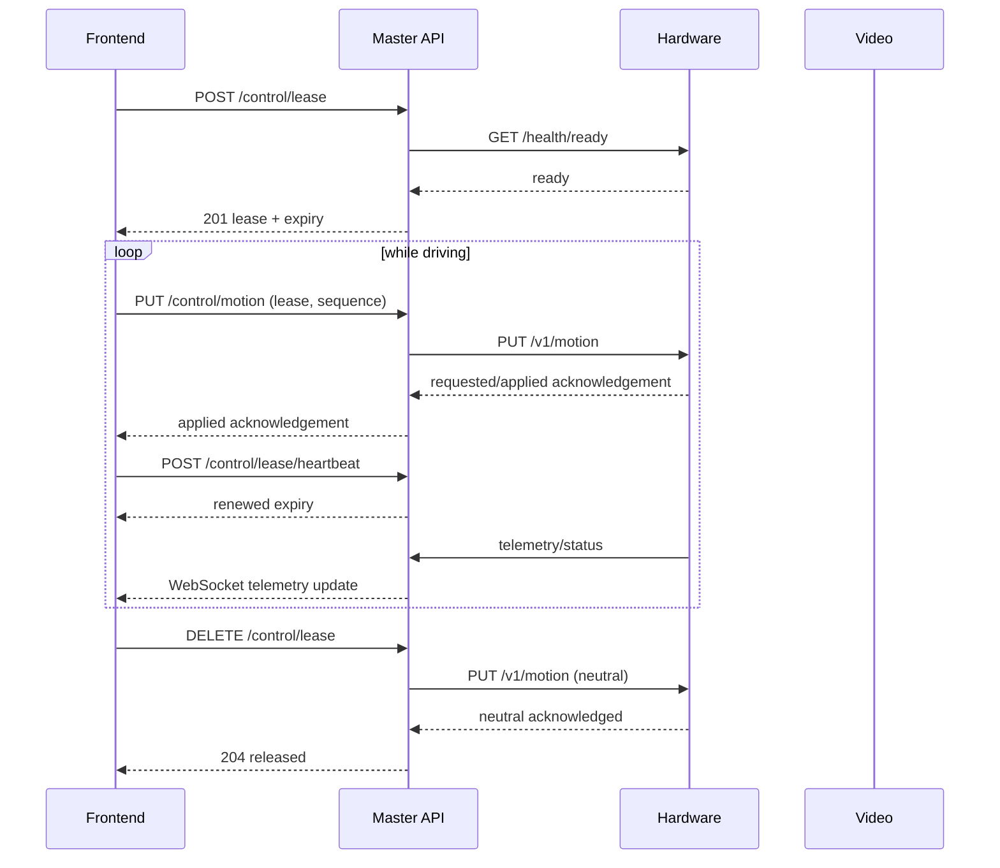

# Master API Interface and Behavior Draft

Status: research draft, not yet an implementation contract

This document makes the broad topics in [Master API Research Notes](../MASTER_API_RESEARCH.md) concrete enough for the frontend, hardware, video, and Master API developers to review together. Values labeled **hypothesis** are starting points for testing, not final safety requirements.

## 1. Scope and assumptions

The first prototype assumes:

- one running Master API process and one worker;
- one hardware container and one video container;
- users reach the services over WireGuard;
- many authenticated users may observe the car;
- no more than one user may control it;
- video media travels directly from the video container to the frontend; and
- all times transmitted through APIs use UTC RFC 3339 strings, while timeout calculations use a monotonic clock inside each process.

The Master API is authoritative for user permissions, control-lease ownership, and top-level system state. The hardware container is authoritative for the last command actually applied to the servo and motor. The video container is authoritative for stream and recording state.

## 2. Domain objects

### Identity session

Represents a signed-in user. It answers “who is making this request?” but does not by itself permit motion.

```json
{
  "user_id": "user-42",
  "roles": ["spectator", "driver"],
  "expires_at": "2026-09-25T19:00:00Z"
}
```

### Control lease

Represents temporary exclusive permission to drive.

```json
{
  "lease_id": "01992a39-8110-7af1-b886-8e7c750d6b34",
  "holder_user_id": "user-42",
  "status": "active",
  "acquired_at": "2026-09-25T18:25:40Z",
  "expires_at": "2026-09-25T18:25:42Z",
  "heartbeat_interval_ms": 500
}
```

The frontend treats `lease_id` as a secret capability and does not log it. The server stores a hashed form if leases are persisted.

### Motion command

Represents the latest desired motion, not a permanent instruction.

```json
{
  "steering": -0.35,
  "throttle": 0.60,
  "sequence": 1842,
  "client_sent_at": "2026-09-25T18:25:43.511Z"
}
```

Rules:

- `steering` and `throttle` are finite numbers in `[-1.0, 1.0]`.
- `0.0` means neutral; do not use omitted values to mean “keep doing the previous thing.”
- `sequence` is an unsigned, increasing integer scoped to one lease.
- The Master API and hardware container reject a sequence number less than or equal to the last accepted number for that lease.
- The server measures receipt age but does not trust the client clock as a safety timer.
- The hardware response reports requested and applied values separately.

## 3. Public API draft

All routes use the `/api/v1` prefix. Except for liveness, requests include `Authorization: Bearer <identity-token>`. Driver-only requests also include `X-Control-Lease: <lease-id>`.

### Health and state

#### `GET /health/live`

Only proves that the Master API event loop can answer.

```json
{
  "status": "alive"
}
```

#### `GET /health/ready`

Returns `200` when required dependencies are usable and `503` otherwise.

```json
{
  "ready": true,
  "system_state": "READY",
  "checks": {
    "hardware": {"ready": true, "latency_ms": 8},
    "video": {"ready": true, "latency_ms": 13}
  },
  "checked_at": "2026-09-25T18:25:40Z"
}
```

#### `GET /system/state`

Returns the current state, active non-secret lease summary, recording summary, and the age of component status.

### Lease lifecycle

#### `POST /control/lease`

Request:

```json
{
  "client_id": "quest-controller-7"
}
```

Outcomes:

- `201`: lease atomically acquired;
- `403`: user does not have the driver role;
- `409 control_lease_held`: an unexpired lease already exists;
- `409 system_not_ready`: top-level state does not allow acquisition.

The response body is the control-lease object. The API must never reveal another user's `lease_id` in a conflict response.

#### `POST /control/lease/heartbeat`

Requires the current lease header. Returns its new `expires_at`. A heartbeat for an expired, released, or unknown lease returns `409 control_lease_inactive`; it must not reactivate the lease.

#### `DELETE /control/lease`

The operation is idempotent for its holder. Before reporting successful release, the Master API requests a neutral motion command. If neutralization cannot be confirmed, it invalidates the lease, enters a safe degraded/emergency state, and returns an error that does not imply the car stopped.

### Motion

#### `PUT /control/motion`

Request body is the motion command above.

Success response:

```json
{
  "accepted_sequence": 1842,
  "requested": {"steering": -0.35, "throttle": 0.60},
  "applied": {"steering": -0.34, "throttle": 0.50},
  "limited_by": ["speed_mode"],
  "hardware_received_at": "2026-09-25T18:25:43.539Z"
}
```

Important behavior:

- Validate identity, lease, state, body, and freshness before calling hardware.
- Never place motion commands in a general-purpose background task after returning success.
- Do not automatically retry an ambiguous timed-out motion request.
- A successful response means hardware acknowledged the command, not merely that the Master API queued it.
- A later command supersedes an earlier command; commands are not a queue of movements to perform.

### Emergency stop

#### `POST /control/emergency-stop`

Proposed policy: any authenticated driver or administrator may trigger it, even if that user does not own the active lease. Rate limiting must not prevent reasonable emergency-stop attempts.

The API:

1. atomically enters `EMERGENCY_STOP`;
2. invalidates the active control lease;
3. sends emergency stop to the hardware service;
4. logs the initiator, request ID, and hardware acknowledgement; and
5. broadcasts the new state to all clients.

The stop remains latched if the hardware call fails. The response must distinguish “stop acknowledged by hardware” from “system latched but hardware acknowledgement unavailable.”

#### `POST /control/emergency-stop/reset`

Administrator-only for the prototype. It succeeds only when throttle input is neutral, hardware reports a safe state, and critical health checks pass.

### Video recording

#### `POST /video/recordings`

Request:

```json
{
  "request_id": "01992a3b-b592-731c-a94a-ceb76b3653fe"
}
```

`request_id` makes repeated start requests idempotent. Return `201` when created, the existing result for the same request ID, or `409 recording_already_active` for a different start request while recording.

#### `DELETE /video/recordings/current`

Stops the current recording. Repeating the request after a successful stop returns the same terminal recording summary rather than starting a new operation.

## 4. Standard error shape

Every non-validation error should follow one shape:

```json
{
  "error": {
    "code": "control_lease_held",
    "message": "Another driver currently controls the car.",
    "request_id": "01992a3c-a22c-7ceb-9585-e5444c28d34c",
    "retryable": true,
    "details": {
      "retry_after_ms": 850
    }
  }
}
```

Error codes are stable API values. Messages may improve without requiring a frontend release. Internal exception text, network addresses, tokens, and stack traces are never returned to clients.

## 5. Driver session sequence



If the heartbeat loop stops, the Master API invalidates the lease and requests neutral. Independently, if valid motion commands stop arriving, the hardware watchdog sets throttle to neutral.

## 6. State transition table

| Current state | Event | Guard | Action | Next state |
| --- | --- | --- | --- | --- |
| `STARTING` | dependency check passed | hardware ready | publish ready event | `READY` |
| `STARTING` | dependency check failed | startup deadline reached | record failed check | `DEGRADED` |
| `READY` | acquire lease | driver role, no lease | create lease | `CONTROLLED` |
| `CONTROLLED` | heartbeat | correct active lease | extend expiry | `CONTROLLED` |
| `CONTROLLED` | release | correct active lease | neutralize, invalidate lease | `READY` |
| `CONTROLLED` | lease timeout | expiry reached | invalidate, neutralize, broadcast | `READY` if confirmed safe; otherwise `EMERGENCY_STOP` |
| `CONTROLLED` | hardware unhealthy | none | invalidate, request stop, alert | `EMERGENCY_STOP` |
| `READY` | video unhealthy | hardware remains ready | mark video unavailable | `DEGRADED` |
| `DEGRADED` | dependencies recovered | readiness policy passes | publish recovery | `READY` |
| any non-shutdown state | emergency stop | authorized caller or internal safety event | invalidate lease, request stop, latch | `EMERGENCY_STOP` |
| `EMERGENCY_STOP` | reset | admin, neutral input, safe hardware, health passed | clear latch | `READY` |
| any state | shutdown | application shutdown begins | reject new work, invalidate, neutralize | `SHUTTING_DOWN` |

Transition changes and their side effects should occur under one state-machine lock in the single-process prototype. Network calls must not leave the lock held indefinitely; model in-progress transitions or use bounded calls and recheck state before committing results.

## 7. Downstream service contracts

### Hardware container

The Master API needs these logical operations, even if the hardware team chooses slightly different paths:

| Operation | Required behavior |
| --- | --- |
| `GET /v1/health/live` | Process responds without touching hardware |
| `GET /v1/health/ready` | Reports servo/motor initialization and watchdog status |
| `PUT /v1/motion` | Validates lease/sequence metadata, applies limits, returns applied values |
| `POST /v1/emergency-stop` | Immediately disables/neutralizes drive and latches locally |
| `POST /v1/emergency-stop/reset` | Clears local latch only when locally safe |
| `GET /v1/telemetry` | Returns applied controls and available hardware readings with timestamps |

Headers or body metadata sent with motion must identify `lease_id`, `sequence`, and Master API request ID. Internal service authentication should prevent an arbitrary VPN client from bypassing the Master API and calling hardware directly.

The hardware container must define:

- its independent motion watchdog interval;
- the physical mapping for normalized controls;
- steering and throttle clamping;
- forward-to-reverse behavior;
- calibration and neutral positions;
- local emergency-stop behavior; and
- whether a reset survives container restart.

### Video container

| Operation | Required behavior |
| --- | --- |
| `GET /v1/health/live` | Process responds |
| `GET /v1/health/ready` | Reports camera and streaming readiness |
| `GET /v1/status` | Reports stream URL/identifier, recording status, and timestamps |
| `POST /v1/recordings` | Idempotently starts recording using an operation ID |
| `DELETE /v1/recordings/current` | Idempotently stops and returns recording metadata |

The video service returns a media identifier/path and status, not the recording bytes, through control endpoints. File download and retention should be designed separately.

## 8. Provisional timing policy

These values are test hypotheses:

| Setting | Initial hypothesis | Reason to test |
| --- | --- | --- |
| Controller command rate | 20 Hz | Likely smooth enough without excessive overhead |
| Frontend heartbeat interval | 500 ms | Multiple chances to renew a short lease |
| Control lease duration | 2 seconds | Tolerates brief jitter but stops reasonably quickly |
| Hardware motion watchdog | 500 ms | Provides local stop if API/network commands disappear |
| Master-to-hardware command deadline | 150 ms | Acknowledgement later than this may already feel stale |
| Health-check deadline | 500 ms | Health is less latency-sensitive than motion |
| Telemetry push rate | 10 Hz | Likely sufficient for UI values; measure bandwidth |

The lease duration is not the hardware safety-stop time. The hardware watchdog should usually stop motion sooner than a user-ownership lease expires.

Do not copy these numbers into production configuration until tests measure:

- local-container baseline latency;
- cellular median, p95, and p99 round-trip time;
- consecutive packet loss and reconnection behavior;
- controller feel at several command rates; and
- how long the car continues moving after each simulated failure.

## 9. Experiments and acceptance criteria

### Experiment A: HTTP versus WebSocket motion

Run identical steering samples at 10, 20, and 30 Hz through an HTTP endpoint and a WebSocket connection. Use a mock hardware service with configurable delay.

Record:

- end-to-end median, p95, and maximum acknowledgement latency;
- dropped/rejected samples;
- CPU and network use;
- reconnect behavior; and
- implementation complexity discovered.

Decision rule: choose HTTP for the first integration if it meets the agreed p95 latency at the required update rate and fails safely. Otherwise use WebSocket for motion while retaining HTTP for session and discrete operations.

### Experiment B: lease race

Send simultaneous acquisition requests for two different users at least 1,000 times.

Acceptance criteria:

- exactly one request wins each round;
- never more than one active lease is observable;
- the losing response reveals no lease secret; and
- an expired lease cannot be renewed after another user acquires control.

### Experiment C: loss of control path

While nonzero throttle is active, separately simulate:

- frontend process termination;
- WireGuard/cellular loss;
- Master API termination;
- hardware request timeout;
- hardware container restart; and
- stale or reordered commands.

Measure time from fault injection to physical or simulated neutral throttle. The team must choose a maximum safe stopping time before declaring this test passed.

### Experiment D: recording idempotency

Duplicate and delay start/stop requests with the same request ID.

Acceptance criteria:

- one logical start creates no more than one recording;
- repeated stop does not fail destructively;
- Master API and video status converge after a timeout; and
- event logs allow the operation to be reconstructed.

### Experiment E: stale telemetry

Pause telemetry from each downstream container without closing its connection.

Acceptance criteria:

- the frontend sees data age or an explicit stale marker;
- stale data is never presented as a fresh measurement; and
- the state machine follows the documented degraded/critical policy.

## 10. Review checklist

Before treating this as an implementation contract, get agreement on:

- [ ] normalized control meanings, ranges, and units;
- [ ] HTTP versus WebSocket motion transport;
- [ ] lease duration and heartbeat interval;
- [ ] independent hardware watchdog behavior;
- [ ] readiness requirements and degraded-mode behavior;
- [ ] emergency-stop trigger and reset permissions;
- [ ] downstream endpoint names and error shapes;
- [ ] telemetry field names, source timestamps, and update rate;
- [ ] authentication between users and Master API;
- [ ] authentication between containers;
- [ ] persistence requirements and single-worker limitation; and
- [ ] measured maximum safe stopping time.

After review, decisions should be copied into versioned OpenAPI schemas and small architecture decision records. Tests should verify those contracts rather than relying only on prose.
